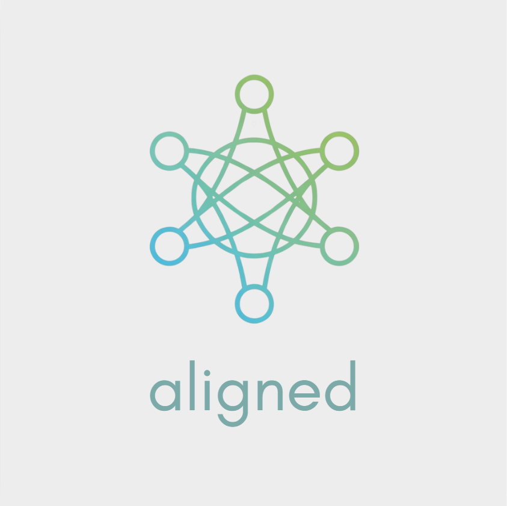

# Aligned 
Personal Relationship Management Platform



A comprehensive personal CRM dashboard that aggregates contacts and interactions from multiple social and professional platforms into a unified interface.

## Problem Statement

Many people interact across multiple platforms (Instagram, LinkedIn, Twitter, etc.) making it difficult to maintain meaningful relationships. RelationCRM provides a centralised dashboard that aggregates contacts, tracks interactions, provides intelligent engagement suggestions, and sends timely reminders while respecting privacy settings.

## Key Features

- **Unified Contact Management**: All contacts across platforms in one place with smart categorisation
- **Platform Integrations**: LinkedIn, Instagram, Twitter, Facebook, GitHub, Slack
- **AI-Powered Engagement**: Birthday reminders, congratulations prompts, follow-up suggestions
- **Smart Reminders**: Tiered system organised by priority (Family, Friends, Colleagues)
- **Privacy & Security**: Secure OAuth, data encryption, granular permission control
- **Analytics Dashboard**: Relationship insights and engagement metrics

## Technology Stack

- React 18 with TypeScript
- Tailwind CSS with shadcn/ui components
- React Query for state management
- Vite build tool
- OAuth 2.0 integration
- Recharts for analytics

## Getting Started

1. **Clone and install**
   ```bash
   git clone <YOUR_GIT_URL>
   cd <YOUR_PROJECT_NAME>
   npm install
   ```

2. **Start development**
   ```bash
   npm run dev
   ```

3. **Access application**
   Open [http://localhost:8080](http://localhost:8080)

## Available Scripts

- `npm run dev` - Start development server
- `npm run build` - Build for production
- `npm run lint` - Run ESLint
- `npm run preview` - Preview production build

## Project Structure

```
src/
├── components/crm/      # CRM-specific components
├── components/ui/       # shadcn/ui components  
├── hooks/              # Custom React hooks
├── lib/                # Utility functions
└── pages/              # Route components
```

## Environment Setup

Create `.env` file:
```env
VITE_API_BASE_URL=your_api_endpoint
VITE_LINKEDIN_CLIENT_ID=your_linkedin_client_id
VITE_INSTAGRAM_CLIENT_ID=your_instagram_client_id
VITE_TWITTER_CLIENT_ID=your_twitter_client_id
```

## Core Components

- **ContactsOverview**: Main contact list with search and filtering
- **ActivityTimeline**: Chronological view of all interactions  
- **EngagementSuggestions**: AI-powered relationship recommendations
- **PlatformIntegrations**: Manage connected social platforms
- **UpcomingReminders**: Smart reminder system with categorisation

## Deployment

### Production Build
```bash
npm run build
```

### Lovable Integration
- Visit the [Lovable Project](https://lovable.dev/projects/f6f3e584-4cf4-4123-b1f5-1c28e26c2dc5)
- Use "Share → Publish" for instant deployment
- Configure custom domains in Project > Settings > Domains

## Security Features

- OAuth 2.0 authentication for secure platform connections
- AES-256 data encryption
- Granular permission management per platform
- Privacy compliance with platform policies

## License

MIT License - see LICENSE file for details.

---

Built for hackathon Problem Statement 6: Personal Relationship CRM for multi-platform social connection management.